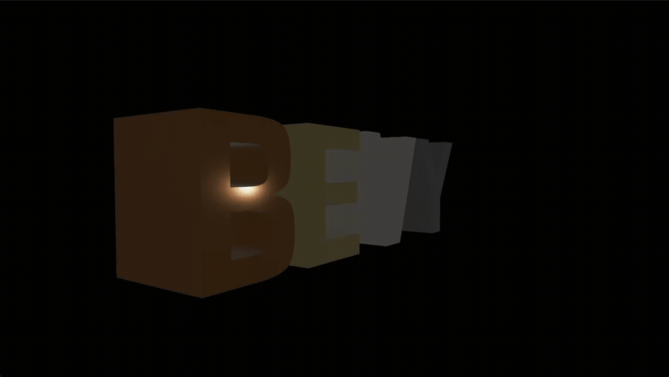

# bevy_fontmesh

[](https://github.com/PoHsuanLai/bevy_fontmesh/actions/workflows/ci.yml)
[](https://crates.io/crates/bevy_fontmesh)
[](https://docs.rs/bevy_fontmesh)
[](LICENSE-MIT)

A simple and focused Bevy plugin for generating 3D text meshes from fonts. Powered by [fontmesh](https://crates.io/crates/fontmesh).

<p align="center">
  
</p>

## What it does

Turns the same `Handle<bevy::text::Font>` you already use for Bevy's 2D UI text into a 3D extruded mesh. You control extrusion depth, anchor, justification, and subdivision quality; Bevy handles materials, lighting, and rendering.

Under the hood, `cosmic-text` shapes the text (kerning, ligatures, BiDi, complex scripts) and [fontmesh](https://crates.io/crates/fontmesh) tessellates each glyph.

## Quick Start

```toml
[dependencies]
bevy = "0.18"
bevy_fontmesh = "0.5"
```

```rust
use bevy::prelude::*;
use bevy_fontmesh::prelude::*;

fn main() {
    App::new()
        .add_plugins(DefaultPlugins)
        .add_plugins(FontMeshPlugin::<StandardMaterial>::default())
        .add_systems(Startup, setup)
        .run();
}

fn setup(
    mut commands: Commands,
    asset_server: Res<AssetServer>,
    mut materials: ResMut<Assets<StandardMaterial>>,
) {
    // `TextMesh` requires `Mesh3d` (and transitively `Transform`/`Visibility`),
    // so you spawn it directly alongside a material.
    commands.spawn((
        TextMesh {
            text: "Hello, World!".to_string(),
            font: asset_server.load("fonts/font.ttf"),
            style: TextMeshStyle {
                depth: 0.5,
                anchor: TextAnchor::Center,
                ..default()
            },
        },
        MeshMaterial3d(materials.add(StandardMaterial::default())),
    ));
}
```

For per-character styling use [`TextMeshGlyphs`]; for custom materials, add the plugin a second time with your material type:

```rust
app.add_plugins(FontMeshPlugin::<MyCustomMaterial>::default())
```

See [docs.rs/bevy_fontmesh](https://docs.rs/bevy_fontmesh) for the full API.

## Rendering both sides

The generated mesh is single-sided (front, back, and outward-facing side walls) — same shape as `ttf2mesh` and previous `bevy_fontmesh` releases. If you look through a glyph's hole (e.g. into the counter of a 'B') and want the back face to render, set:

```rust
StandardMaterial {
    double_sided: true,
    cull_mode: None,
    ..default()
}
```

The examples in this repo all do this.

## Examples

```bash
cargo run --example basic                  # Simple 3D text
cargo run --example multiline              # Multiline with anchoring
cargo run --example justification          # Text alignment
cargo run --example anchors                # All anchor points
cargo run --example per_glyph              # Per-character styling
cargo run --release --example stress_test  # Performance test
cargo run --release --example showcase     # Metallic "BEVY" with orbiting camera
```

## Supported Formats

- TrueType (`.ttf`) — fully supported
- OpenType with TrueType outlines (`.otf`) — fully supported
- OpenType with CFF/PostScript outlines (`.otf`) — fully supported (new in 0.4)

## Bevy Version Compatibility

| bevy_fontmesh | Bevy |
| ------------- | ---- |
| 0.2 – 0.5     | 0.18 |
| 0.1           | 0.17 |

## License

Licensed under either of [MIT](LICENSE-MIT) or [Apache-2.0](LICENSE-APACHE) at your option.
